class: middle, center, inverse

# Don't repeat yourself, talk to yourself! Repeated reporting in the R universe

```{r setup, include=FALSE}
options(htmltools.dir.version = FALSE)
knitr::opts_chunk$set(echo = FALSE, fig.align = "center", out.width = "90%")
library(demoR)
```

.pull-left[
```{r, out.width = "60%"}

```

### bit.ly/sharstudioconf
]

.pull-right[
```{r, out.width = "60%"}

```

### @SharlaGelfand
]

---
background-image: url("images/process/old-process-4.png")

---
background-image: url("images/process/old-process-5.png")

---
background-image: url("images/process/old-process-8.png")

---
class: center

# The reports took all year!

.pull-left[
```{r businessman-hourglass}

```
]

.pull-right[

They weren't reproducible

They were scattered, 

hard to keep track of, boring, manual, repetitive

not easily repeatable
]

---
class: middle
background-image: url("images/logos/R.png")

---
background-image: url("images/process/new-process-1.png")

---
background-image: url("images/process/new-process-2.png")

---
background-image: url("images/process/new-process-3.png")

---
class: center, middle

.pull-left[
<br>
Reproducibility!

Code all in one place!

It'll be worth it!

We can do new things!
]

.pull-right[
```{r businessman-energy}

```
]

---
layout: true

# Next year arrives

---

```{r files-original, out.width = "55%"}
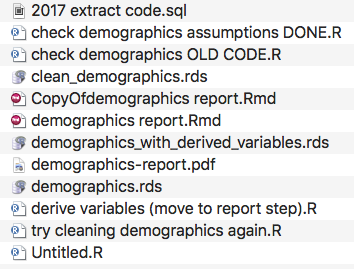
```

---
```{r clean-data-artisanal}
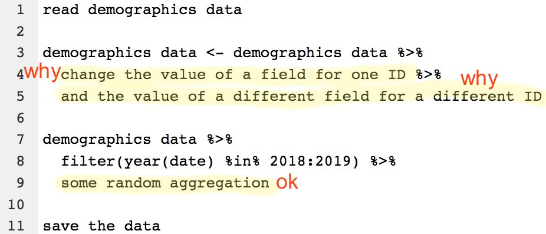
```

---
layout: false
class: center

.pull-left[
# SPSS, Excel, Word

Not reproducible

Difficult to keep track of

Manual and repetitive

Not easily repeatable

Time consuming
]

--

.pull-right[
# My R code

Kind of reproducible

Difficult to keep track of

Manual and repetitive

Not easily repeatable

Time consuming
]

---
class: center, middle, inverse

# Don't repeat yourself

# Talk to yourself!

---
class: center
# Don't repeat yourself

### Abstract away repetitive logic and automate repetitive processes

.pull-left[
```{r businessman-three-hand, out.width = "75%"}

```
]

.pull-right[
<br>
Copy and pasting is error prone

Focus should be on what changes

Copying over and over and redoing work is pointless
]

---
class: center

# Talk to yourself

### It's easier to document why you're doing something now than to remember why you did it a year ago

.pull-left[
```{r businessman-talk-to-yourself, out.width = "65%"}
knitr::include_graphics("images/businessman/high-five.jpg")
```
]

.pull-right[
<br>
Focus on future-self instead of present-self

Easy-to-read code doesn't explain motivations
]

---
class: middle, center, inverse
# I cleaned up after myself

```{r businessman-papers, out.width = "50%"}

```

---
## Reorganize files

```{r files-original-2, out.width = "50%"}

```

---
## Reorganize files

```{r files-reorgaize-tidy, out.width = "50%"}
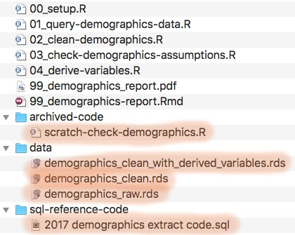
```

---
## Default ordering

```{r files-ordering, out.width = "50%"}
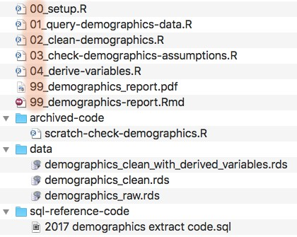
```

---
## Setup file

```{r setup-initial, out.width = "98%"}
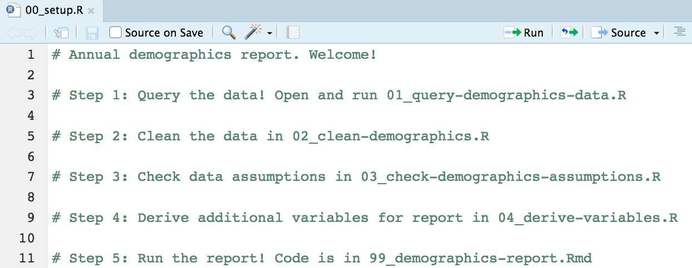
```

---
layout: false
class: middle, center, inverse
# I made functions

```{r businessman-gears, out.width = "50%"}

```

---
class: middle

```{r clean-data-original, out.width = "95%"}
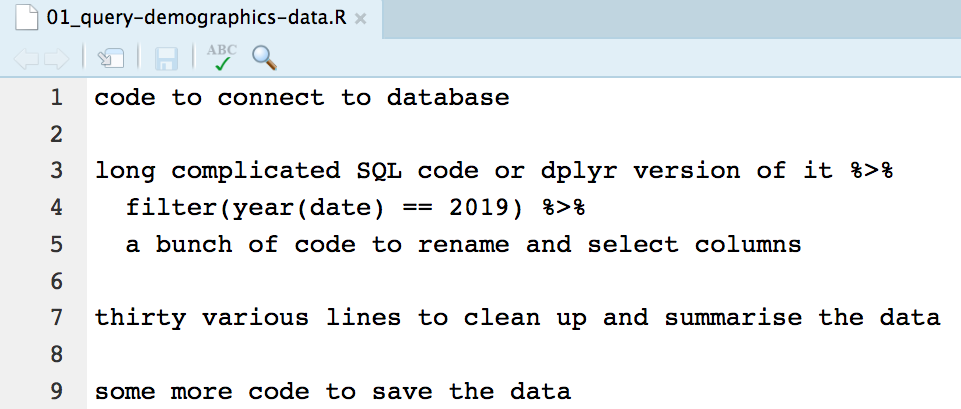
```

---
class: middle

```{r, out.width = "95%"}
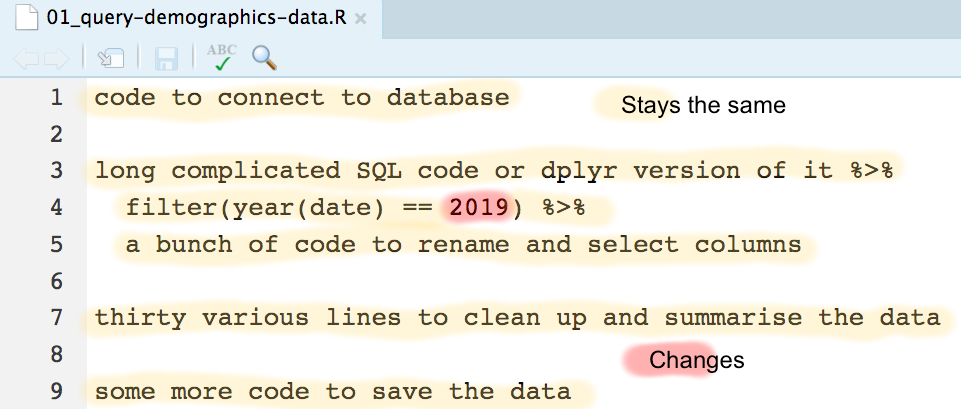
```

---
class: center

.pull-left[
**Body:** what stays the same
]

.pull-right[
**Argument:** what changes
]

```{r, out.width = "80%"}
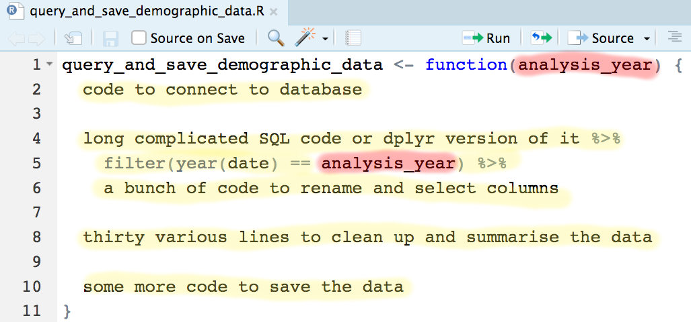
```

---
class: center, middle

```{r setup-with-function, out.width = "100%"}
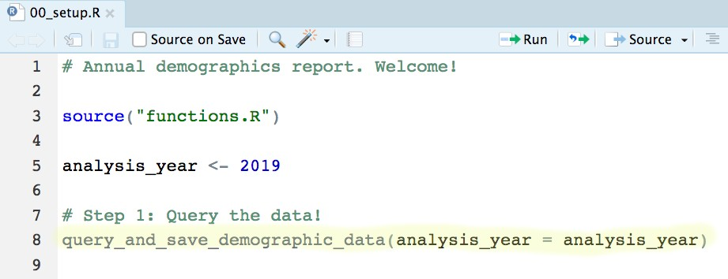
```

---
background-image: url(images/logos/usethis-small.png)
background-position: top right
background-size: 125px 145px
## Chatty functions

```{r usethis, comment = NA, echo = TRUE, eval = FALSE}
library(usethis)
ui_info("hi!")
```

```{r, out.width = "15%", fig.align = "left"}

```

---
background-image: url(images/logos/usethis-small.png)
background-position: top right
background-size: 125px 145px
## Chatty functions

```{r, echo = TRUE, eval = FALSE}
analysis_year <- 2019

ui_todo("Querying demographics data for
        {analysis_year}...")
```

```{r, fig.align = "left"}
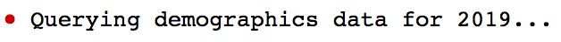
```

---
## Chatty functions

```{r function-noisy, out.width = "100%"}
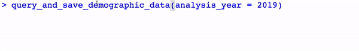
```

---

class: middle, center, inverse
# I made code templates

```{r businessman-lorem-ipsum, out.width = "50%"}

```

---
class: center

## Artisanal data doesn't require artisanal code

.pull-left[
```{r artisan-data}
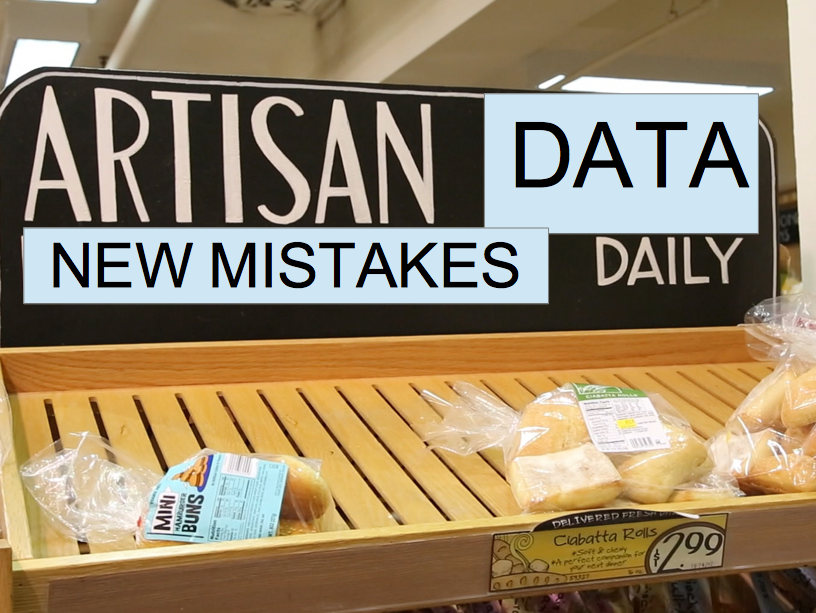
```
]

.pull-right[
<br>
Used to focus on cleaning *this* data really well

Too specific!

No idea why I did something

]

---
class: center
layout: false
## Code templates

.pull-left[
<br>
Generalizable code

Super specific instructions

Deal with artisanal data instead of remembering what to do
]

.pull-right[
```{r businessman-template, out.width = "80%"}

```
]

---
layout: true
## Prescriptive templates

---

```{r template-original}
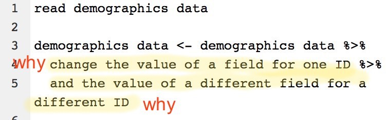
```

---

  
```{r template-instructions, out.width = "100%"}
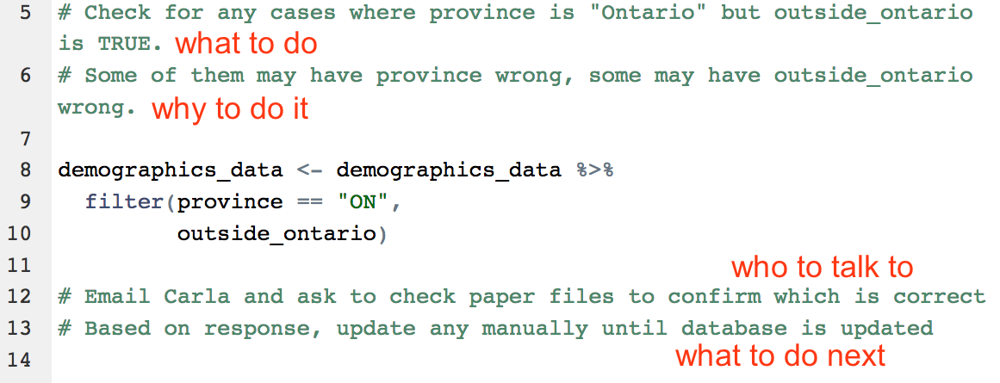
```

---
layout: false
## Automating templates

```{r automating-templates-1, echo = TRUE}
clean_data <- function(analysis_year) {
  usethis::use_template(
    template = "clean_data.R", #<<
    save_as = "01_clean-data.R",
    data = list(analysis_year = analysis_year),
    package = "demographicsreport"
  )
}
```

---
layout: false
## Automating templates

```{r automating-templates-2, echo = TRUE}
clean_data <- function(analysis_year) {
  usethis::use_template(
    template = "clean_data.R",
    save_as = "01_clean-data.R", #<<
    data = list(analysis_year = analysis_year),
    package = "demographicsreport"
  )
}
```

---
layout: false
## Automating templates

```{r automating-templates-3, echo = TRUE}
clean_data <- function(analysis_year) {
  usethis::use_template(
    template = "clean_data.R",
    save_as = "01_clean-data.R",
    data = list(analysis_year = analysis_year), #<<
    package = "demographicsreport"
  )
}
```

---
layout: false
class: middle, center, inverse
# I put it all together in a package

```{r businessman-boxes, out.width = "50%"}

```

---
class: center
## Why make a package?

.pull-left[
```{r businessman-box}

```
]

.pull-right[
<br>
Organize functions

Home for templates

Better documentation

Share code with coworkers
]

---

```{r package-blank, out.width = "75%"}
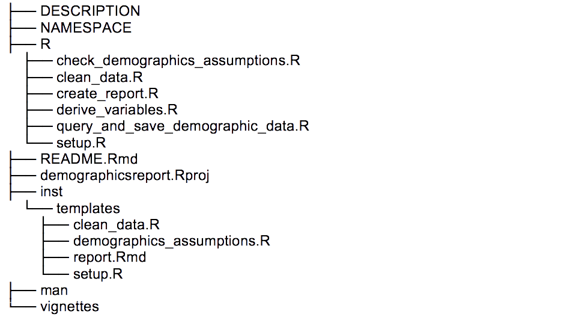
```

---

```{r package-functions, out.width = "75%"}
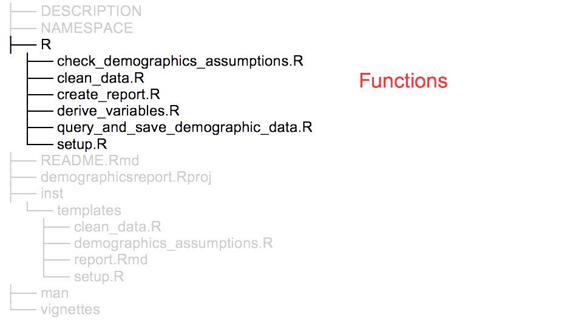
```

---

```{r package-templates, out.width = "75%"}
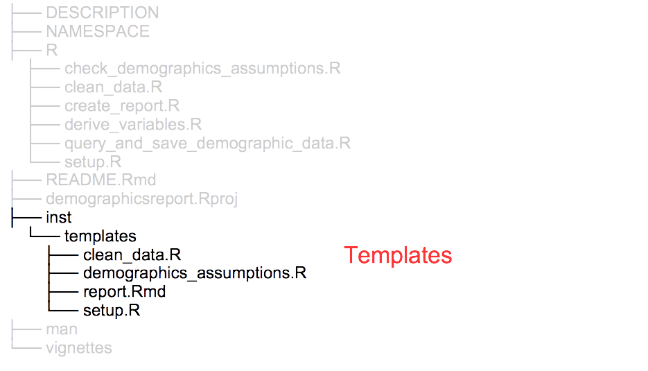
```

---

```{r package-documentation, out.width = "75%"}
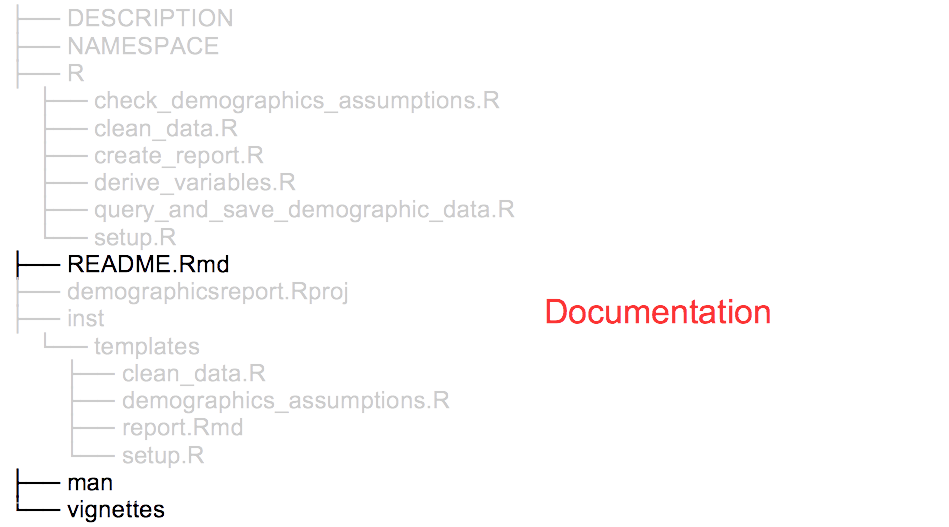
```

---

```{r package-setup, out.width = "75%"}
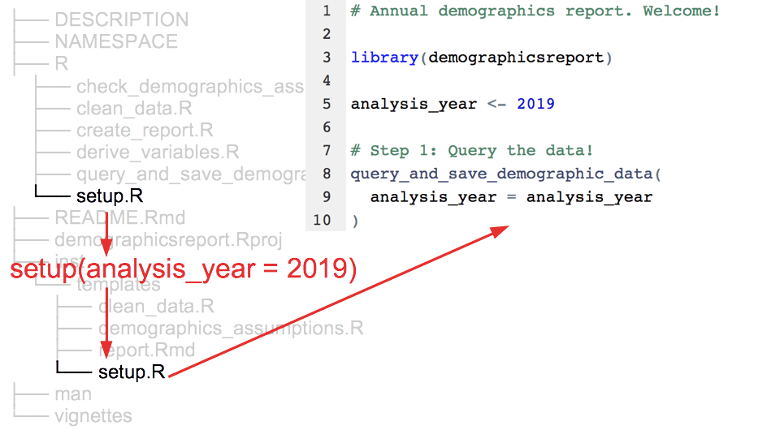
```

---

```{r package-query, out.width = "75%"}
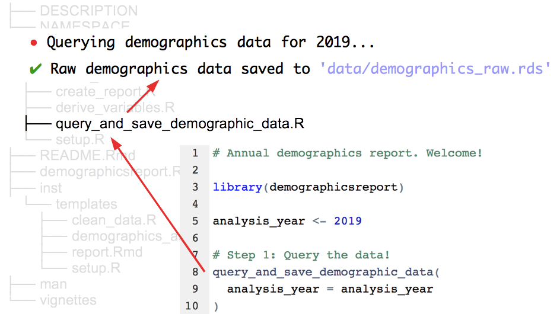
```

---

layout: false
class: middle, center

.pull-left[
## Don't repeat yourself
Cleaned up files

Functions

Templates

Packages
]

.pull-right[
## Talk to yourself!
Clear names and ordering

Chatty functions

Prescriptive templates

Package documentation
]

---
class: center, middle

# Repeated reporting in the R universe

.pull-left[
```{r businessman-party}

```
]

.pull-right[
Reproducible `r emo::ji("white_check_mark")` 

Easy to keep track of `r emo::ji("white_check_mark")` 

Minimal manual work `r emo::ji("white_check_mark")` 

Easily repeatable `r emo::ji("white_check_mark")` 

Frees up time... to spend making R packages `r emo::ji("tipping_hand_woman")`
]

---
class: middle, center

## If you have a repetitive task, abstract or automate what you can and loudly communicate the rest!

--

# Don't repeat yourself, talk to yourself!

--

.pull-left[
Slides: [bit.ly/sharstudioconf](https://bit.ly/sharstudioconf)

Tweets: @sharlagelfand
]

.pull-right[
Blog post: [bit.ly/usethis4reporting](bit.ly/usethis4reporting)

Images: Amonrat Rungreangfangsai
]
