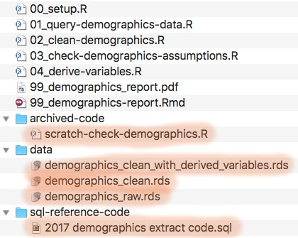
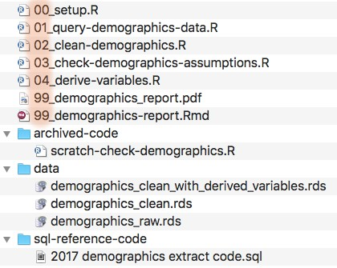
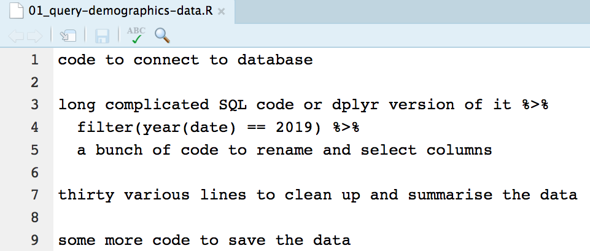
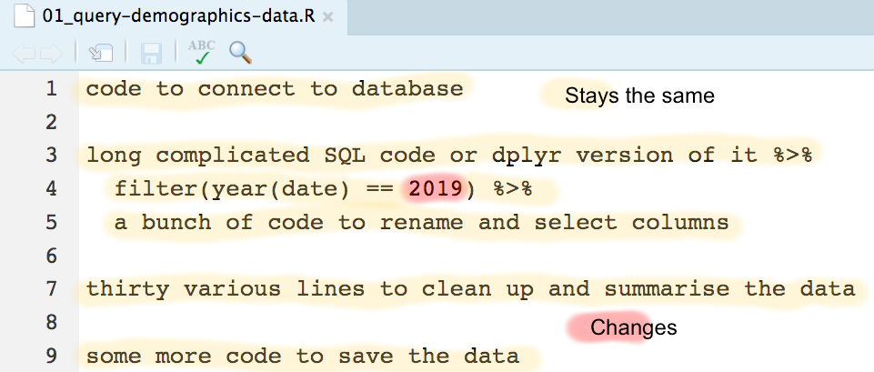
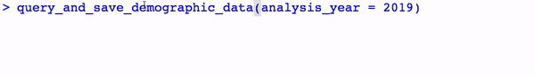
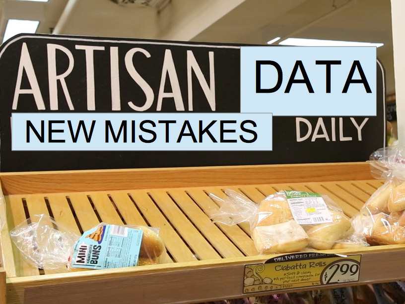
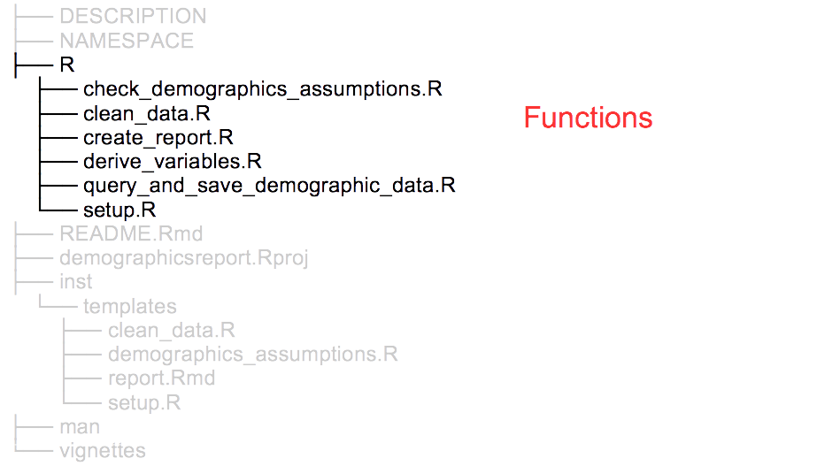
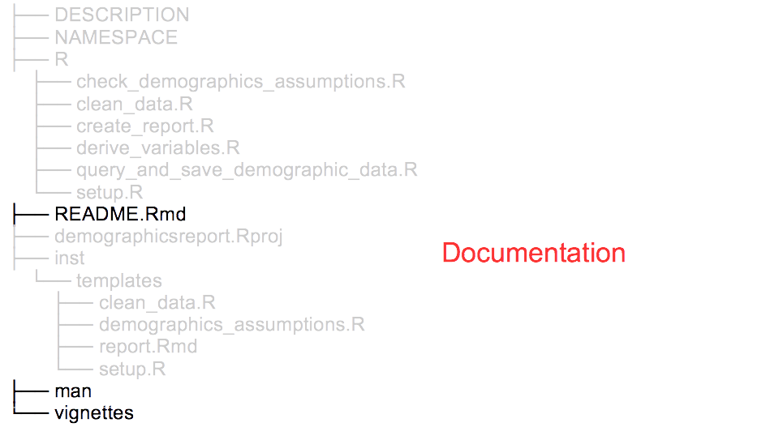
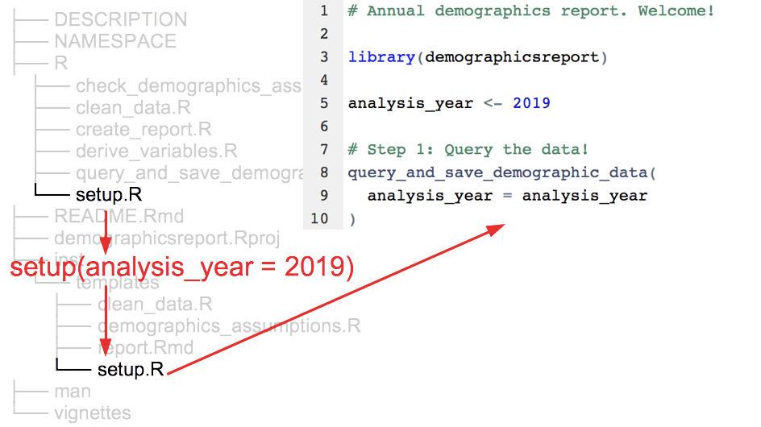

class: middle, center, inverse

# Don't repeat yourself, talk to yourself! Repeated reporting in the R universe

```{r setup, include=FALSE}
options(htmltools.dir.version = FALSE)
knitr::opts_chunk$set(echo = FALSE, fig.align = "center", out.width = "90%")
library(demoR)
```

.pull-left[
```{r, out.width = "70%"}
knitr::include_graphics("images/businessman/nurse-1.jpg")
```

### bit.ly/sharstudioconf
]

.pull-right[
```{r, out.width = "70%"}
knitr::include_graphics("images/businessman/calendar.jpg")
```

### @SharlaGelfand
]

???

* statistician ontario nursing

* reports every year

* spss, excel, word, decisions in email and paper

* manual, familiar

Hi everyone, thanks for having me. I'm here today to talk to you about repeated reporting.

This talk came from my experiences at my last job, where I was a statistician working with data on Ontario's nursing workforce.

We had a set of reports and other activities that occurred on a pretty regular, yearly basis.

These reports used to be done using SPSS, Excel, and Word, with a lot of decisions kept track of in emails and paper notes. The process was pretty manual, and might sound familiar to some of you. 

---
background-image: url("images/process/old-process-1.png")

???

You somehow acquire the data. In our case, we asked the IT team to query the data and sent it to us.

---
background-image: url("images/process/old-process-2.png")

???

You clean and explore the data using SPSS. You make summary tables in SPSS.

---
background-image: url("images/process/old-process-3.png")

???

You open up Excel, where there are nicely formatted tables, delete the oldest year of data, and put the new data in the table.

---
background-image: url("images/process/old-process-4.png")

???

You open up a Word document that has been used for this report for the last five years and is definitely haunted by now, replace the old tables with the new ones, and change the year of the report and some numbers in the text.

---
background-image: url("images/process/old-process-5.png")

???

Read the report and discover a mistake in the data

---
background-image: url("images/process/old-process-6.png")

???

Find the mistake and fix it in SPSS

Re-make summary tables in SPSS

---
background-image: url("images/process/old-process-7.png")

???

Replace old-new data in Excel with new-new data

---
background-image: url("images/process/old-process-8.png")

???

Update the tables and text in Word

Again, sound familiar?

---
class: middle, center

# The reports took all year!

.pull-left[
```{r businessman-hourglass}
knitr::include_graphics("images/businessman/hourglass.jpg")
```
]

.pull-right[

They weren't reproducible

They were scattered,

hard to keep track of,

boring, manual, repetitive,

not easily repeatable
]
???

We needed to write these reports every year. But writing them would take all year.

They weren't reproducible. Things were scattered and difficult to keep track of. The work was boring, manual, repetitive, and not easily repeatable. Instead of being able to do new things on the job, we were stuck doing the same work over and over again.

---
class: middle
background-image: url("images/logos/R.png")

???

Now, I haven't been completely honest. When I say "we", I mean my coworkers did this. There is no "I" in "We". I started my job knowing that I didn't want to use SPSS. I took about a week to understand how we did things and waited for my opportunity. I was having lunch with my coworker, and I look over the table at her and I'm like... hey. Have you heard of R?

And phew! She had! She used it in grad school and was more than happy to use it more. She was eager for opportunities to improve the process, learned more R, and quickly fell into the pit of success.

So, as a team, we decided to transition all of our projects over to R, and convinced the powers-that-be, too.

---
background-image: url("images/process/new-process-1.png")

???

We got the queries from IT, learned about our database structure, and used dplyr and dbplyr to query it.

---
background-image: url("images/process/new-process-2.png")

???
 
We used tidyr, janitor, naniar, and other tidyverse packages to clean our data

---
background-image: url("images/process/new-process-3.png")

???
 
We used tidyr, janitor, naniar, and other tidyverse packages to clean our data

We used RMarkdown, kableExtra, and ggplot2 to write reports

Everything fit so well, almost as if everything was designed to work together, and pretty soon our workflow started looking a lot my laptop.

---
class: middle, center

.pull-left[
<br>
Reproducibility!

Code all in one place!

It'll be worth it!

We can do new things!
]

.pull-right[
```{r businessman-energy}
knitr::include_graphics("images/businessman/energy.jpg")
```
]

???

We were so proud of what we had accomplished.

Our work was reproducible, and we didn't have to redo everything if we found a mistake!

All of our code was in one place, and easier to keep track of.

It took a bit of time to transition projects over to R, but we knew it would be worth it! Instead of spending time doing the same thing over and over again, we could do new things!

---
layout: true

# Next year arrives

---

???

Next year comes and I'm feeling good. Things would be so much easier! We had R! It's basically foolproof. 

Without fail, for each project I'd come back to my R code, ready to knock it off the to-do list, and see something like this:

--

.pull-left[
```{r files-original}
knitr::include_graphics("images/files/blank-original.png")
```
]

.pull-right[
```{r businessman-confused-signs}

```
]

???

I go, I look at my files thinking it would be easier, but I just don't know where to start.

Nothing is named clearly, there's no order to things, all of the code and data is jumbled, and it's just a mess.

what files are what, what order things go in, which code was usable and which was old, 

---
.pull-left[
```{r clean-data-artisanal}

```
]

.pull-right[
```{r businessman-confused-paper}

```
]

???

So I take a stab at guessing which files I actually used last year, open up, and see something like this:

I'd come back to my code and not be able to tell

why any data cleaning decisions were made, what the point of some code was, how to easily reuse my code, written so specifically for last year's data

have to go through and remember what's what, copy files over, etc. I was so frustrated, right, because...

---
layout: false
class: center, middle

.pull-left[
# SPSS, Excel, Word

Not reproducible

Difficult to keep track of

Manual and repetitive

Not easily repeatable

Time consuming
]

--

.pull-right[
# My R code

Kind of reproducible

Difficult to keep track of

Manual and repetitive

Not easily repeatable

Time consuming
]

---
class: center, middle, inverse

# Don't repeat yourself

# Talk to yourself!

???

To deal with this, I developed a set of approaches, guided by two principles: Don't repeat yourself, and talk to yourself!

I hope it's useful to those of you who use R for this kind of repetitive reporting.

---
class: center
# Don't repeat yourself

.pull-left[
```{r businessman-three-hand, out.width = "75%"}

```
]

.pull-right[
Copy and pasting code is time consuming and error prone

Focus is on what stays the same, instead of what changes

Repetition present in processes
]

???

Concept from software engineering

Repeating yourself by copy and pasting code is time consuming and error prone. Every time you have to make an update, you have to make it everywhere the code is. It's also distracting because you're overloading yourself with code that stays the same, instead of focusing on what changes.

This is why we use functions and packages in R. I'm sure you've heard the mantra - if you're going to repeat the same code three times, make it into a function. Doing this is abstraction.

But we also see repetition arise in processes. In my case, copying the same code over year-to-year, having to remember what code is important, what needs to be changed, and how to redo work I already did, is repetition. You might not be able to abstract it away, but you can try to automate it.

--

**Abstract away repetitive logic and automate repetitive processes**

???

So for me, don't repeat yourself comes down to this: abstract away repetitive logic and automate repetitive processes.

---
class: center
# Talk to yourself

.pull-left[
```{r businessman-talk-to-yourself, out.width = "75%"}
knitr::include_graphics("images/businessman/high-five.jpg")
```
]

.pull-right[
<br>
Work built for now-you, not future-you

Easy-to-read code doesn't explain motivations
]

--

**Document why you're doing something now instead of trying to remember why you did it in a year**

???

Talk to yourself is a concept from... me, that I thought made sense and sounded good in contrast with Don't repeat yourself.

The idea here is that it's easier to remember rand document why you're doing something now than to remember why you did it a year ago.

The goal is to keep your future-self in mind by making your work speak for itself, literally, with an opinionated look at how and why things were done.

I failed at talking to myself because none of my code was designed with reuse in mind. The files were jumbled, had an unclear order, and I had no idea why I did anything or how to do it again.

---
class: middle, center, inverse
# I cleaned up after myself

```{r businessman-papers, out.width = "50%"}
knitr::include_graphics("images/businessman/papers.jpg")
```

???

Why did my old process violate dry and tty?

The way I left my old code wasn't conducive to reuse because it led to a lot of repetition of process. There was a lot of repetition and a lack of talking to myself because I was making myself re-learn where things were, what they did, and what to do.

---
## Reorganize files

.pull-left[

```{r files-original-2, out.width = "85%"}
knitr::include_graphics("images/files/blank-original.png")
```
]

???

This is such an easy win. I was literally being rude to my future self by leaving my files looking like this.

---
## Reorganize files

.pull-left[

```{r files-reorganize-original, out.width = "85%"}

```
]

.pull-right[

```{r files-reorgaize-tidy, out.width = "97%"}

```
]

???

So, I separated out my data files, reference code, and even old, archived code from the main code.

I named things more cleanly to actually communicate what each file does.

---
## Default ordering

.pull-left[

```{r files-original-3, out.width = "85%"}
knitr::include_graphics("images/files/blank-original.png")
```
]

.pull-right[

```{r files-ordering, out.width = "97%"}

```
]

???

I took advantage of the default ordering of files (by name!), using numbers to indicate what order things need to happen in.

Even if this is all you do, it makes it so much easier to come back to the next time you have to work on something. When you have to repeat this work, you can just copy the files and go through them in the clear order.

Reorganizing and renaming files is a form of letting my files speak for me.

---
## Setup file

```{r setup-initial, out.width = "98%"}
knitr::include_graphics("images/code/setup/setup-initial.png")
```

???

In case things weren't painfully obvious from the order of files, I also created a setup file to organize the whole thing. This is useful for getting the project started, like a README or an introductory vignette when using an R package for the first time.

I used the setup file to explain a bit about the project, where to start (do I need to email someone to kick it off?), and what the individual steps are.

This is a clear example of talking to myself, and taking the time to explain how and why to do something, rather than just leaving an artifact of what I already did.

---
layout: false
class: middle, center, inverse
# I made functions

```{r businessman-gears, out.width = "50%"}

```

???

Why did my old process violate dry and tty?

Once I left my files in a usable state as a whole, I started thinking about them individually. How could I make going through them less manual and repetitive? What could I abstract away and not have to think about?

An obvious way to deal with this is to start making functions.

---
class: middle

```{r clean-data-original, out.width = "95%"}

```

???

In my case, code used to query data and do some basic cleaning was a good candidate.

---
class: middle

```{r, out.width = "95%"}

```

???

In this code, mostly everything stays the same, and only the year changes.

---

```{r, out.width = "80%"}
knitr::include_graphics("images/code/functions/clean-data-function-change-vs-same.png")
```

.pull-left[
**Body:** what stays the same
]

.pull-right[
**Argument:** what changes
]

???

I can take what stays the same and make it the body of my function

And take what changes and make it an argument

And then I don't have to worry about running through this code, copying it over, or updating the logic in multiple places if it changes.

---
class: middle

```{r setup-with-function, out.width = "85%"}

```

???

Then, instead of having my setup file tell me to go run through 01..., I could just have a function that queries the data for me.
 
---
layout: false
## Chatty functions


```{r function-quiet, out.width = "85%"}

```

???

I had successfully abstracted away logic by making my data querying code into a function, but I had no idea what happened with it.

Something is obviously happening, but what?

Talk to yourself!

--

.pull-left[
```{r usethis-logo, out.width = "50%"}
knitr::include_graphics("images/logos/usethis.png")
```
]

.pull-right[
Use interactivity to make chatty functions!

```{r usethis, comment = NA, echo = TRUE}
library(usethis)
ui_info("hi!")
```
]

???

I aimed to make my functions do the work of communicating for me, so that future me knew exactly what was going on. The usethis package is awesome for many many things. It has these UI functions that you can use in your own functions to print different types of output to the console.

---
## Chatty functions

```{r usethis-code, comment = NA, echo = TRUE, eval = FALSE}
analysis_year <- 2019

ui_todo("Querying demographics data for {analysis_year}...")

data_path <- "data/demographics_raw.rds"

ui_done("Raw demographics data saved to {ui_path(data_path)}")
```

???

You can include code in these UI functions and so they can contain information about what's happening (like, what year the data is being queried for) and where the file is saved.

--

```{r function-noisy, out.width = "90%"}

```

???

Then, when you run the function it prints information to the console that helps you keep track of what's going on!

---

class: middle, center, inverse
# I made code templates

```{r businessman-lorem-ipsum, out.width = "50%"}
knitr::include_graphics("images/businessman/lorem-ipsum.jpg")
```

???

I knew that not all of my code could be logic'd away. Our projects had a lot of very specific data cleaning steps, back and forth, checking of assumptions, and other things that required some level of human interaction. 

---
class: center

## Artisanal data doesn't require artisanal code

.pull-left[
```{r artisan-data}

```
]

???

We had artisanal data, and there was no way to automate functions around that.

--

.pull-right[
<br>
Used to focus on cleaning *this* data really well

Too specific!

No idea why I did something

]

???

But my problem was that I was always so focused on cleaning *this* data really well. The code that I was writing was too specific and not useful for needing to clean a new batch of the same data.

I only knew what I had done last time, but not what I needed to look for this time.

---
class: center
layout: false
## Code templates

.pull-left[
Generalizable code

Super specific instructions

What to look for, who to ask, what to do
]

.pull-right[
```{r businessman-template, out.width = "80%"}

```
]

???

Instead of writing super specific code, I started to write super specific, prescriptive instructions to lead to data cleaning steps, including information on what to look for, who to ask, and what to do.

Doing this actually left me *more* time to deal with artisanal data in the future, because I wasn't wasting it trying to remember what I had to do.

I took this opportunity to talk to myself and explain what and why to do something.

Instead of writing super specific code, write super specific instructions to lead to data cleaning steps.

Then, turn those into templates to be used.

Actually gives you more time to deal with artisanal data

usethis template...

Easily repeatable.

Easy to keep track of.

# I made code templates for future me

* What needs to be done
* Instructions
* Fresh copy every time

???

For everything that can't be totally abstracted away, make code templates.

Write generalizable code with instructions on assumptions that need to be checked, things that need to be cleaned, who to ask, etc.

An opportunity to actually deal with your artisanal data, year after year, because you have instructions. rather than just cleaning one specific data set really well.

---
layout: true
## Prescriptive templates

---

```{r template-original}

```

--
  
```{r template-instructions}

```

???

If you need specific instructions to email someone, *give those instructions*. When I started my job I found it hard to keep track of who to ask about certain things, so I actually codified it so I wouldn't be left wondering next time.

---
layout: false
## Automating templates

```{r automating-templates-1, echo = TRUE}
clean_data <- function(analysis_year) {
  usethis::use_template(
    template = "clean_data.R", #<<
    save_as = "01_clean-data.R",
    data = list(analysis_year = analysis_year),
    package = "demographicsreport"
  )
}
```

???

In order to avoid repetition and automate producing this function, I used the usethis package to create a function that takes the template

---
layout: false
## Automating templates

```{r automating-templates-2, echo = TRUE}
clean_data <- function(analysis_year) {
  usethis::use_template(
    template = "clean_data.R",
    save_as = "01_clean-data.R", #<<
    data = list(analysis_year = analysis_year),
    package = "demographicsreport"
  )
}
```
???

makes and saves a copy of it

---
layout: false
## Automating templates

```{r automating-templates-3, echo = TRUE}
clean_data <- function(analysis_year) {
  usethis::use_template(
    template = "clean_data.R",
    save_as = "01_clean-data.R",
    data = list(analysis_year = analysis_year), #<<
    package = "demographicsreport"
  )
}
```
???

and can even pass data to it!

---
layout: false
class: middle, center, inverse
# I put it all together in a package

```{r businessman-boxes, out.width = "50%"}
knitr::include_graphics("images/businessman/boxes.jpg")
```

???

Then, I put everything into a package. A project like this is a great candidate for making into your own R package, and I promise it's not as scary as it seems.

---
class: center
## Why make a package?

.pull-left[
```{r businessman-box}
knitr::include_graphics("images/businessman/box.jpg")
```
]

.pull-right[
<br>
Organize functions

Home for templates

Better documentation

Share code with coworkers
]

???

Why make a package? As I mentioned, a package is really an ultimate form of "don't repeat yourself". Your functions live in a centralized place and it's always clear where they need to be updated. If you make a package, your templates have a place to live and you can take advantage of other functions to copy and pass data to them. Packages allow for really robust documentation to properly communicate what everything does, and it's an easier way to share code with your coworkers.

---

```{r package-blank, out.width = "75%"}
knitr::include_graphics("images/package-dir/blank.png")
```

???

When I was all said and done, I had a package that looked something like this

---

```{r package-functions, out.width = "75%"}

```

???

My functions had a home in the R/ directory

---

```{r package-templates, out.width = "75%"}
knitr::include_graphics("images/package-dir/templates.png")
```

???

And my templates lived in a special place that allowed them to be copied and used

---

```{r package-documentation, out.width = "75%"}

```

???

And I had documentation in the form of a README, function documentation in the man folder, and you could even make vignettes that describe things in detail.

---

```{r package-setup, out.width = "75%"}

```

???

To put it all together - 
My setup function pulled a setup template, and made a file with the other functions to run through the analysis.

---

```{r package-query, out.width = "75%"}
knitr::include_graphics("images/package-dir/query-data.png")
```

???

Within that template, there was a function to query the data, which did so and did it chattily, abstracting away the logic to query but making sure I would know where things were being saved.

---

layout: false
class: middle, center

.pull-left[
## Don't repeat yourself
Cleaned up code

Functions

Templates

Packages
]

.pull-right[
## Talk to yourself!
Clear names and ordering

Chatty functions

Prescriptive templates

Package documentation
]

???

And so I used the approaches of don't repeat yourself and talk to yourself by cleaning up my code with clear names and ordering, creating chatty functions to abstract away logic and communicate what they were doing, automated and prescriptive templates designed to help me know what i needed to do year after year, and created a package that put it all together.

---
class: center, middle

# Repeated reporting in the R universe

.pull-left[
```{r businessman-party}
knitr::include_graphics("images/businessman/party.jpg")
```
]

.pull-right[
Reproducible `r emo::ji("white_check_mark")` 

Easy to keep track of `r emo::ji("white_check_mark")` 

Minimal manual work `r emo::ji("white_check_mark")` 

Easily repeatable `r emo::ji("white_check_mark")` 

Frees up time... to spend making R packages `r emo::ji("tipping_hand_woman")`
]

???

And using this method for repeated reporting, I ended up with projects that were reproducible, easy to keep track of, had minimal manual work, and was easily repeatable. It also freed up time... that I spent making other R packages.

---
class: middle, center

## If you have a repetitive task, abstract or automate what you can and loudly communicate the rest!

--

# Don't repeat yourself, talk to yourself!

???

So, my takeaway to you is that if you find yourself doing a repetitive task, confusing yourself, and doing the same work over and over again: abstract or automate what you can, and loudly communicate the rest

Or, because it's more catchy: don't repeat yourself, talk to yourself!

--

.pull-left[
Slides: [bit.ly/sharstudioconf](https://bit.ly/sharstudioconf)

Tweets: @sharlagelfand
]

.pull-right[
Blog post: [bit.ly/usethis4reporting](bit.ly/usethis4reporting)

Images: Amonrat Rungreangfangsai
]
